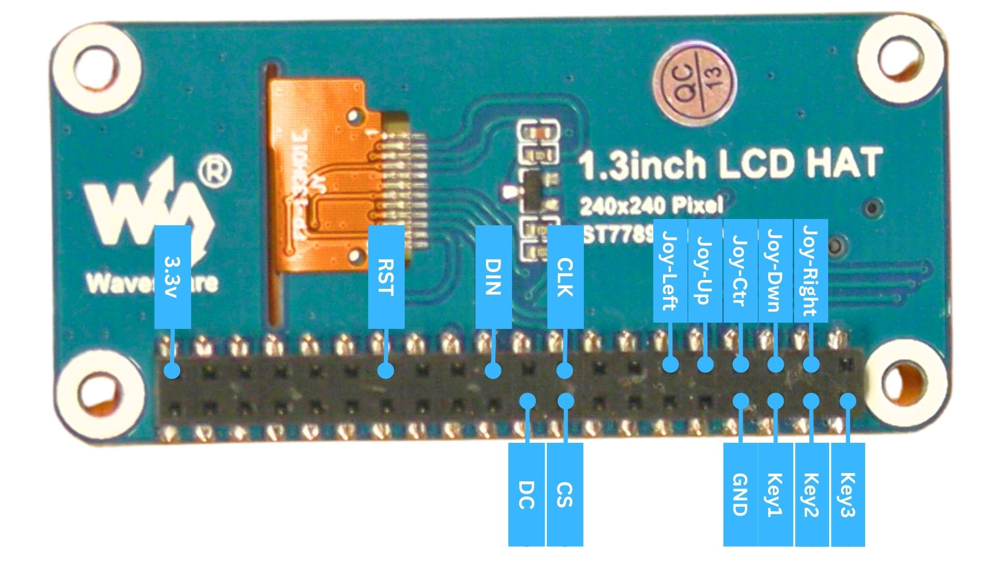

# ESP32-Wrover-Cam Assembly

**Note on Clone ESP32-WROVER-CAM Boards**

In addition to the 'official' ESP32-WROVER-CAM boards from Freenove, there are also a number of readily available, low cost 'clones'.

Some of these clones have will have different ports (Freenove with USB-C and cloes with MicroUSB), the camera position is slightly different (Hence why the example 3d printed cases have a rather large camera hole) and they also sometimes have slightly different startup behavior.

Some clone boards won't boot properly until you press the EN/RST pin after powering up the device. If your board behaves in this way, the simplest solution is to connect the EN/RST pin on your ESP32-WROVER-CAM board to a spare button on your LCD hat. (Pressing this button will then allow you to boot/reset the device at any time)

## Power Pins
| Function Pin (On Display Hat)     | Pin Number (On ESP32) |
| ----------- | ----------- |
| VSYS | 5V (Might be labled VCC) on Pico 1.14 hat, 3.3v for 1.4 inch hat|
| GND | GND | 

## Display Pins
| Function Pin (On Display Hat)     | Pin Number (On ESP32) |
| ----------- | ----------- |
| DIN     | 12       |
| CLK| 2
| CS | 15        |
| DC | 13 |
| RST | 14 |
| BL | 3.3v (Might be labled 3v3) - May not need to be connected with some hats... |

## Input Pins
| Function Pin (On Display Hat)     | Pin Number (On ESP32) |
| ----------- | ----------- |
| CTRL      | 0       |
| A | 32        |
| B | 33 |

_You can also connect this to any of the other buttons on your display hat._

# Connection Diagram
## Waveshare Pico 1.14 LCD Hat

## Waveshare 1.3 LCD Hat
You can also swap the LCD hat for other LCD hats, such as the one commonly used with SeedSigner. You connect the pins to the same place on the ESP32, connecting to the hat using the pins below. (Backlight pin doesn't need to be connected)

Given that this hat is a different resolution than the retail Jade, you also need to adjust the x and y offsets for the gui.

    CONFIG_DISPLAY_OFFSET_X=0
    CONFIG_DISPLAY_OFFSET_Y=0
    CONFIG_DISPLAY_WIDTH=240
    CONFIG_DISPLAY_HEIGHT=240

This can be done using the command `idf.py menuconfig` and navigating to `Blockstream Jade` -> `Display Driver` and adjusting the Gui display offsets with the values above. You can build and flash to apply the new configuration.
